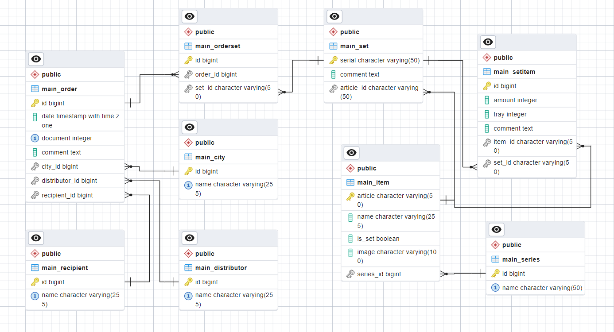

# passport
Packing list management tool / inventory management tool

### Running:
Running `python manage.py migrate` creates an empty database prefilled with the following initial data for the company:

Distributor "Warehouse" - intended for managing stock\
Recipient "[Incomplete]" - intended for keeping incomplete/broken/otherwise unusable stock\
Recipient "[Main]" - main warehouse

These objects are referred to by their IDs in the code and can be safely renamed, but shouldn't be removed. Checks are in place to prevent deletion in the UI, but they can still be vulnerable to direct SQL queries.

### Sample dataset:
To fill database with auto-generated sample data, run:

`python .\manage.py populate_db`

## ERD

## TODO
* implement analytics
* add tests
* export for detail views?
* image storage solution